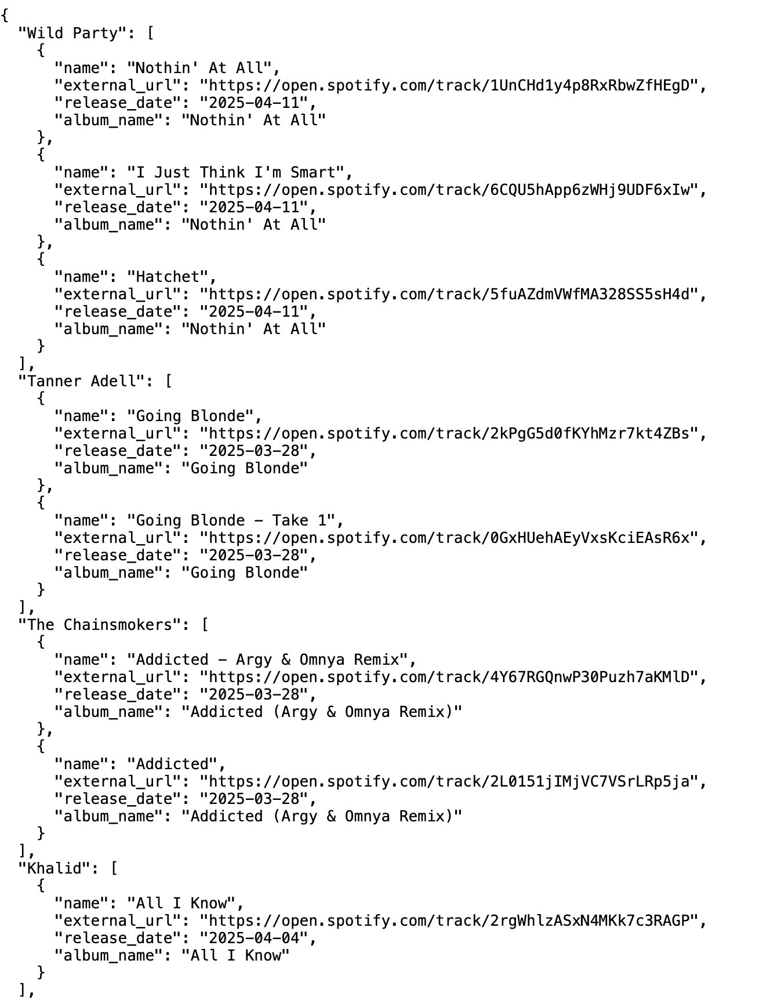

# Spotify-Api
Ever wish Spotify showed new music from your favorite artists like Youtube/s Subscription page? This project brings that idea to life by integrating with the Spotify API to fetch and display the latest album and single releases from artists the user follows.

# Deployment is still ongoing

  
<strong style="font-size: 26px;">Environment Variables </strong>

**The environmenet variables are securely stored online as GitHub secrets. Only trusted collaborators will be able to access these variables for local development.**

  
<strong style="font-size: 26px;">Prerequisites</strong>

- Install Docker
- Python 3.12.3

  
<strong style="font-size: 26px;">Local Setup for Collaborators</strong>

1. Clone repository and navigate to it:
    - git clone https://github.com/"GIT_USERNAME"/spotify-api.git

    - cd spotify-api

2. Create an `.env` file in the root directory of the project.
    - Add the following lines to the `.env` file w/ the actual values:
        - `CLIENT_ID`: Spotify API client ID.
        - `CLIENT_SECRET`: Spotify API client secret.
        - `REDIRECT_URI`: Spotify API redirect URI

2. Run this command to build and run the docker container: 
    - `docker  compose up --build`

3. Login w/ your spotify account and grant authorization to the API

  
<strong style="font-size: 26px;">Testing</strong>

 - Run `pytest test_main.py` to start tests locally
 - There is a CI workflow established for test automation

  
<strong style="font-size: 26px;">Endpoints </strong>

###  Login 
- **URL**: `http://localhost:8888/login`
- **Method**: `GET`
- **Description**: The login endpoint prompts the user for their Spotify login. If successful, it will then prompt the user to grant authorization access to the application through the OAuth protocol.
- **Response**: 
  - **Success**: Redirects to `http://localhost:8888/callback`
  - **Error**: Returns an error message if authentication fails.

