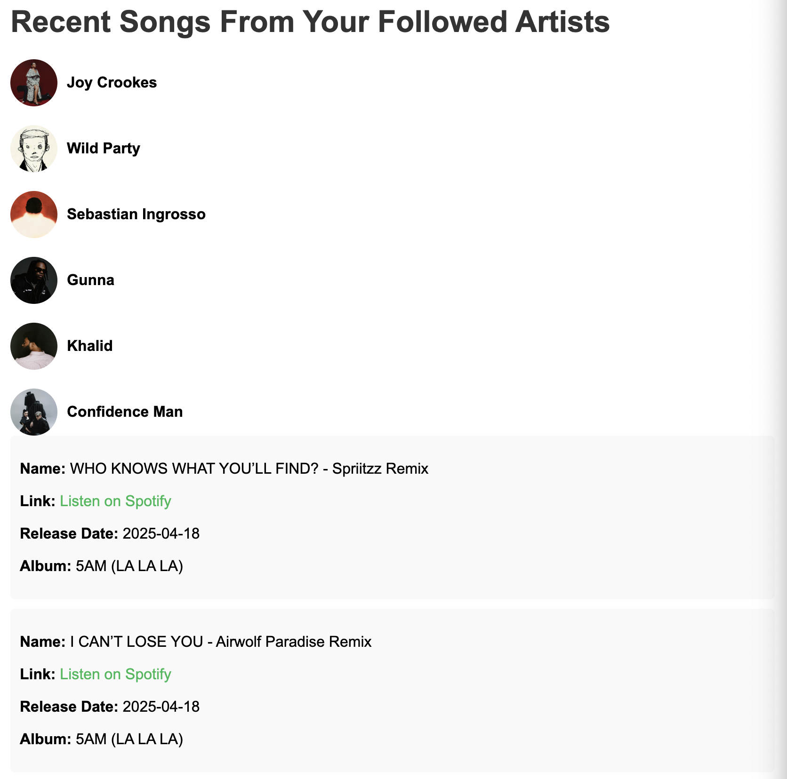

# Spotify-Api
Ever wish Spotify showed new music from your favorite artists like Youtube/s Subscription page? This project brings that idea to life by integrating with the Spotify API to fetch and display the latest album and single releases from artists the user follows.



# Deployment is still ongoing

<details>
  <summary><strong style="font-size: 32px;">Technologies</strong></summary>

 - Python 3.9
 - JavaScript
 - HTML
 - Docker 
 - FastAPI
 - GitHub Actions 

</details>

<details>
  <summary><strong style="font-size: 32px;">To-Dos / Future Features</strong></summary>

 - Implement filter buttons to sort songs by artist and release date
 - Implement log out endpoint
 - Modify UI to display album cover for songs

</details>

<details>
  <summary><strong style="font-size: 32px;">How to Build / Run</strong></summary>

1. Turn on Docker Desktop 
2. Clone repository and navigate to it:
    ```sh
    git clone https://github.com/"GIT_USERNAME"/spotify-api.git
    ```

3. Create an `.env` file based on the `.env.example` file.

4. Build and run the docker container
    ```sh
    docker  compose up --build
    ```

5. Follow the link to login w/ your spotify account and grant authorization to the API
    ```sh
    http://localhost:8888/login
    ```
</details>

<details>
  <summary><strong style="font-size: 32px;">Testing</strong></summary>

 - Run this command to start tests locally
    ```sh
    pytest test_main.py
    ```
 - There is a CI workflow established for test automation

</details>

<details>
  <summary><strong style="font-size: 32px;">Endpoints </strong></summary>

###  Login 
- **URL**: `http://localhost:8888/login`
- **Method**: `GET`
- **Description**: The login endpoint prompts the user for their Spotify login. If successful, it will then prompt the user to grant authorization access to the application through the OAuth protocol.
- **Response**: 
  - **Success**: Redirects to `http://localhost:8888/callback`
  - **Error**: Returns an error message if authentication fails.

</details>

